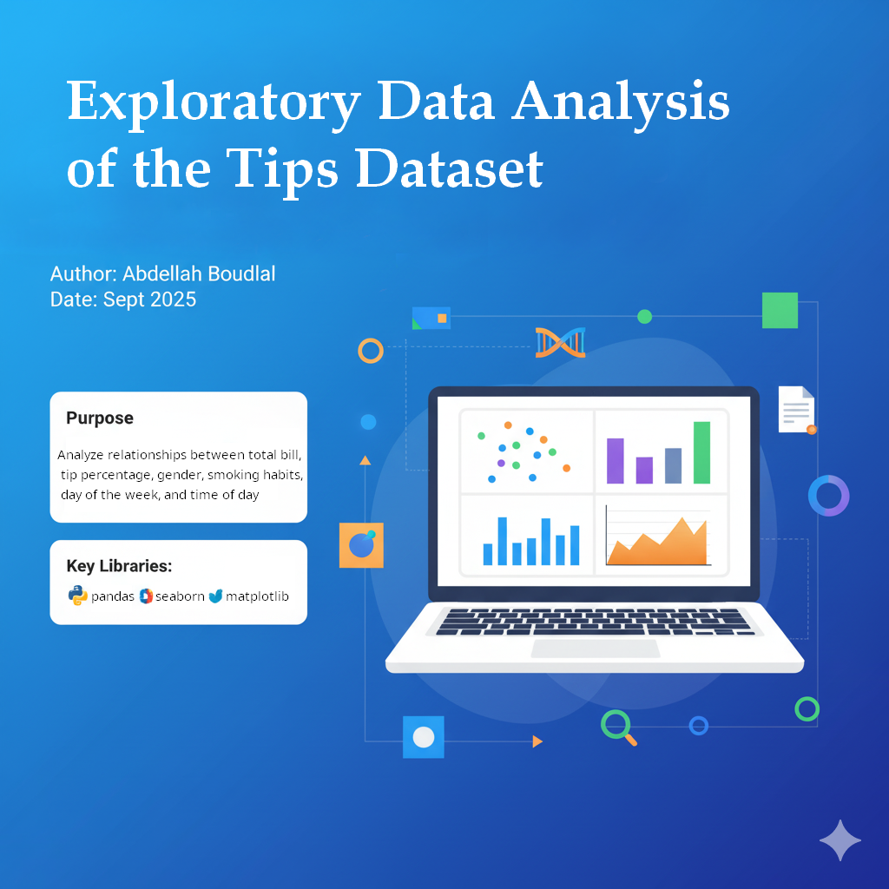

# Project 6: Exploratory Data Analysis (EDA)

## Author
Abdellah Boudlal



## Repository
[GitHub Repo](https://github.com/Aboudlal/datafun-06-eda)

## Dataset
We used the `tips.csv` dataset, which contains restaurant bill and tip information such as:
- Total bill
- Tip
- Gender
- Smoker status
- Day of week
- Time (Lunch/Dinner)
- Party size

## Requirements
- Python 3
- pandas
- seaborn
- matplotlib
- jupyterlab

## Setup
```bash
# Create and activate a virtual environment
python -m venv .venv
.\.venv\Scripts\Activate.ps1   # Windows
source .venv/bin/activate      # Mac/Linux

# Install dependencies
pip install pandas seaborn matplotlib jupyterlab
